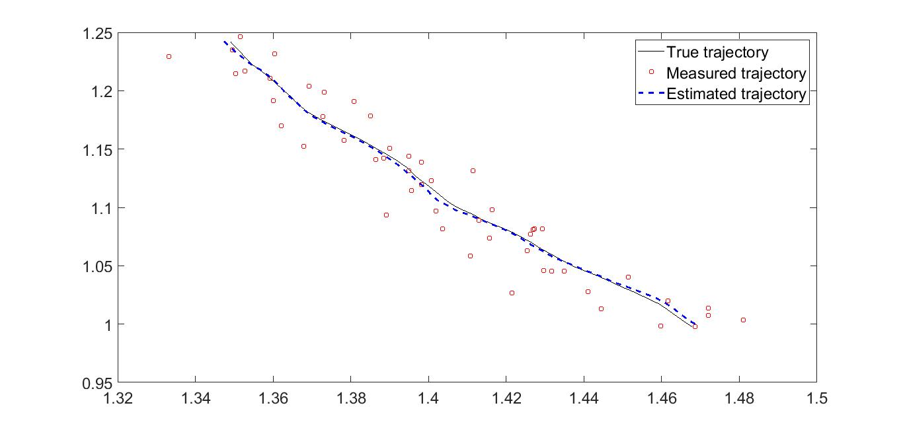

# Kalman-Filter
The repository implements Kalman Filter for state estimation problem. We assume Markov process in deriving the KF equations. The state vector X is  are as follows: 

| State | Description                 |
| ----- | --------------------------- |
| x     | x coordinate                |
| y     | y coordinate                |
| vx    | Velocity along X coordinate |
| vy    | Velocity along Y coordinate |

## System and Sensor model

The system model is defined as follows: 

```
X(k) = F*x(k-1) + V
```

where, 

```
V ~ N(0, T^2 * Qk) is White gaussian Noise with covariance matrix Qk
and
F = I + A*T; 
Given that, 
A is a system parameter and T is sampling time. 
```

Similarly, the sensor observations, assuming the sensor observes all states in X, is governed by the following equation:

```
Yk = H*Xk + W_k; 
where H is an identity matrix and Wk is white random gaussian noise and is defined as follows:
W_k ~ (0, Rk); Rk is covariance matrix 
```

## Results 

The estimated trajectory along with the sensor readings and the true values are plotted in the figure below. As can be observed, the KF is able to estimate the trajectory with very high accuracy. 

 